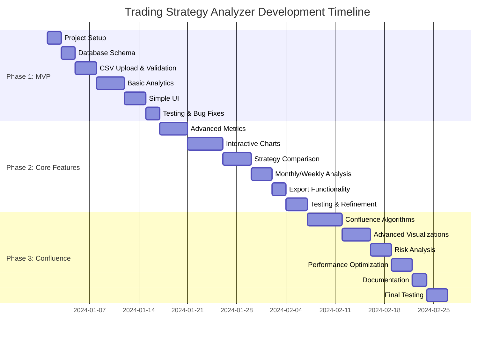

# Development Roadmap & Project Setup Guide

## Project Phases Overview



## Phase 1: MVP (2 weeks)

### Week 1: Foundation
**Days 1-2: Project Setup**
- [ ] Create project directory structure
- [ ] Initialize virtual environment
- [ ] Install required dependencies
- [ ] Set up version control (Git)
- [ ] Create basic Streamlit app skeleton

**Days 3-4: Database Layer**
- [ ] Design and implement SQLite schema
- [ ] Create database manager class
- [ ] Implement CRUD operations for strategies
- [ ] Add data validation and error handling

**Days 5-7: CSV Processing**
- [ ] Build CSV upload interface
- [ ] Implement data validation logic
- [ ] Create data standardization functions
- [ ] Add error handling for malformed data

### Week 2: Basic Features
**Days 8-11: Core Analytics**
- [ ] Implement basic performance calculations
- [ ] Create monthly/weekly breakdown functions
- [ ] Add key metrics calculation (P&L, win rate, etc.)
- [ ] Build simple data display tables

**Days 12-14: User Interface**
- [ ] Create strategy management page
- [ ] Build basic performance analysis page
- [ ] Add navigation between pages
- [ ] Implement basic styling and layout

**MVP Deliverables:**
- ✅ Upload CSV files with strategy labeling
- ✅ View monthly and weekly performance breakdowns
- ✅ Basic strategy management (add, delete, replace data)
- ✅ Simple performance metrics display

## Phase 2: Enhanced Features (3 weeks)

### Week 3: Advanced Analytics
**Days 15-18: Enhanced Metrics**
- [ ] Implement Sharpe ratio, Sortino ratio calculations
- [ ] Add maximum drawdown analysis
- [ ] Create profit factor and expectancy metrics
- [ ] Build rolling performance analysis

**Days 19-21: Data Visualization**
- [ ] Integrate Plotly for interactive charts
- [ ] Create cumulative returns charts
- [ ] Build drawdown visualization
- [ ] Add performance comparison charts

### Week 4: Strategy Comparison
**Days 22-25: Multi-Strategy Features**
- [ ] Build strategy selector interface
- [ ] Implement side-by-side comparison tables
- [ ] Create correlation analysis functions
- [ ] Add performance ranking system

**Days 26-28: Time Period Analysis**
- [ ] Enhanced monthly analysis with drill-down
- [ ] Detailed weekly performance patterns
- [ ] Best/worst period identification
- [ ] Seasonal performance analysis

### Week 5: Polish & Export
**Days 29-30: Export Features**
- [ ] CSV export for analysis results
- [ ] PDF report generation
- [ ] Excel export with multiple sheets

**Days 31-35: Testing & Refinement**
- [ ] Comprehensive testing with sample data
- [ ] Performance optimization
- [ ] UI/UX improvements
- [ ] Bug fixes and edge case handling

**Phase 2 Deliverables:**
- ✅ Interactive charts and visualizations
- ✅ Advanced performance metrics
- ✅ Strategy comparison tools
- ✅ Export functionality
- ✅ Improved user interface

## Phase 3: Confluence Analysis (3 weeks)

### Week 6: Confluence Algorithms
**Days 36-40: Core Confluence Logic**
- [ ] Implement signal overlap detection
- [ ] Build correlation analysis engine
- [ ] Create confluence strength scoring
- [ ] Add time-window based analysis

### Week 7: Advanced Visualizations
**Days 41-44: Confluence Visualization**
- [ ] Correlation matrix heatmaps
- [ ] Confluence timeline charts
- [ ] Risk-return scatter plots
- [ ] Multi-strategy performance overlays

### Week 8: Risk & Optimization
**Days 45-47: Risk Analysis**
- [ ] Portfolio risk calculations
- [ ] Concentration risk analysis
- [ ] Diversification benefit quantification

**Days 48-50: Performance & Documentation**
- [ ] System performance optimization
- [ ] Caching implementation
- [ ] User documentation creation

**Days 51-56: Final Testing**
- [ ] End-to-end testing
- [ ] Performance testing with large datasets
- [ ] User acceptance testing
- [ ] Bug fixes and final polish

**Phase 3 Deliverables:**
- ✅ Complete confluence analysis system
- ✅ Advanced risk analytics
- ✅ Performance optimization
- ✅ Comprehensive documentation

## Quick Start Setup Guide

### Prerequisites
- Python 3.9 or higher
- 2GB+ available RAM
- 1GB+ free disk space

### 1. Environment Setup
```bash
# Clone or create project directory
mkdir trading_analyzer
cd trading_analyzer

# Create virtual environment
python -m venv venv

# Activate virtual environment
# Windows:
venv\Scripts\activate
# macOS/Linux:
source venv/bin/activate

# Upgrade pip
pip install --upgrade pip
```

### 2. Install Dependencies
```bash
# Create requirements.txt
cat > requirements.txt << EOF
streamlit>=1.28.0
pandas>=2.0.0
numpy>=1.24.0
plotly>=5.0.0
scipy>=1.10.0
scikit-learn>=1.3.0
sqlalchemy>=2.0.0
streamlit-aggrid>=0.3.0
openpyxl>=3.1.0
python-dateutil>=2.8.0
EOF

# Install dependencies
pip install -r requirements.txt
```

### 3. Project Structure Setup
```bash
# Create directory structure
mkdir -p {config,pages,utils,models,components,tests,.streamlit}

# Create main application file
touch main.py

# Create configuration files
touch .streamlit/config.toml
touch config/settings.py
```

### 4. Basic Configuration
```toml
# .streamlit/config.toml
[global]
dataFrameSerialization = "legacy"

[server]
port = 8501
maxUploadSize = 200

[theme]
primaryColor = "#1f77b4"
backgroundColor = "#ffffff"
secondaryBackgroundColor = "#f0f2f6"
```

### 5. Initial Run
```bash
# Create minimal main.py
cat > main.py << EOF
import streamlit as st

st.set_page_config(
    page_title="Trading Strategy Analyzer",
    page_icon="📊",
    layout="wide"
)

st.title("Trading Strategy Analyzer")
st.write("Welcome to your trading strategy confluence analysis system!")

if st.button("Get Started"):
    st.success("System ready for development!")
EOF

# Run the application
streamlit run main.py
```

## Development Best Practices

### Code Organization
- **Modular Design**: Keep each component focused and reusable
- **Clear Naming**: Use descriptive function and variable names
- **Documentation**: Comment complex algorithms and business logic
- **Error Handling**: Implement graceful error handling throughout

### Testing Strategy
- **Unit Tests**: Test individual functions with pytest
- **Integration Tests**: Test complete workflows
- **Manual Testing**: Regular testing with sample data
- **Performance Testing**: Monitor memory usage and response times

### Version Control
```bash
# Initialize Git repository
git init
git add .
git commit -m "Initial project setup"

# Create .gitignore
cat > .gitignore << EOF
__pycache__/
*.pyc
.env
.venv/
venv/
*.db
.streamlit/secrets.toml
.DS_Store
EOF
```

### Data Management
- **Sample Data**: Create realistic test datasets
- **Data Validation**: Always validate input data
- **Backup Strategy**: Regular database backups
- **Performance Monitoring**: Monitor for memory leaks

## Success Metrics & Milestones

### Phase 1 Success Criteria
- [ ] Successfully upload and process sample CSV files
- [ ] Display accurate monthly/weekly breakdowns
- [ ] Handle data validation errors gracefully
- [ ] Complete workflow takes < 5 minutes for typical dataset

### Phase 2 Success Criteria
- [ ] Interactive charts load in < 3 seconds
- [ ] Strategy comparison works for 5+ strategies
- [ ] Export functions produce correct outputs
- [ ] System handles 10,000+ trades efficiently

### Phase 3 Success Criteria
- [ ] Confluence analysis provides actionable insights
- [ ] Correlation calculations are mathematically accurate
- [ ] System performance remains good with large datasets
- [ ] User can complete full analysis workflow intuitively

## Risk Mitigation

### Technical Risks
- **Data Corruption**: Implement transaction rollbacks
- **Performance Issues**: Use caching and optimization
- **Memory Problems**: Implement data pagination
- **UI Complexity**: Keep interface simple and intuitive

### Project Risks
- **Scope Creep**: Stick to defined phases
- **Timeline Delays**: Build MVP first, enhance iteratively
- **User Adoption**: Regular testing with real data
- **Maintenance**: Document all key decisions and algorithms

## Post-Launch Enhancements

### Future Features (Phase 4+)
- Real-time data connections
- Advanced machine learning insights
- Multi-user support
- Cloud deployment
- API for external integrations
- Mobile responsiveness
- Advanced risk management tools

This roadmap provides a clear path from concept to fully functional trading strategy analysis system. Each phase builds upon the previous one, ensuring steady progress toward your goal of comprehensive confluence analysis.